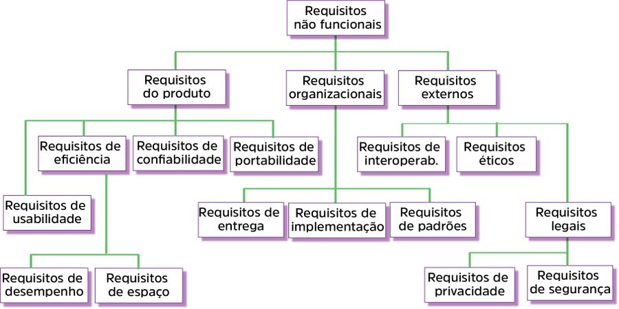

Também conhecidos como RNF, suplementares ou de qualidade, os requisitos não funcionais declaram as características que o sistema deve possuir e que estão relacionadas às suas funcionalidades ou seja, requisitos mais abstratos, segue alguns exemplos:
- performance
- portabilidade
-  segurança
- usabilidade
- qualidade do serviço (QoS)
- confidencialidade
- confiabilidade
- portabilidade
- precisão
- integridade
- eficiência

Os requisitos não funcionais podem ser mais severos e críticos que os requisitos funcionais; isso quer dizer que, se eles não forem atendidos, então, o sistema não serve: se não satisfaz, o sistema é inútil. Esses tipos de requisitos são as causas das principais insatisfações dos usuários com relação ao software.

Também são classificados em três tipos, sendo eles: requisitos do produto final, requisitos organizacionais e requisitos externos. Os requisitos do produto final referem-se a como o produto deve se comportar, sua velocidade de execução, confiabilidade, ente outros. Os requisitos organizacionais dizem respeito à consequência de políticas e procedimentos organizacionais que devem ser seguidos. Os requisitos externos são concernentes a fatores externos ao sistema e ao processo de desenvolvimento.

# Exemplo detalhado de requisitos não funcionais

