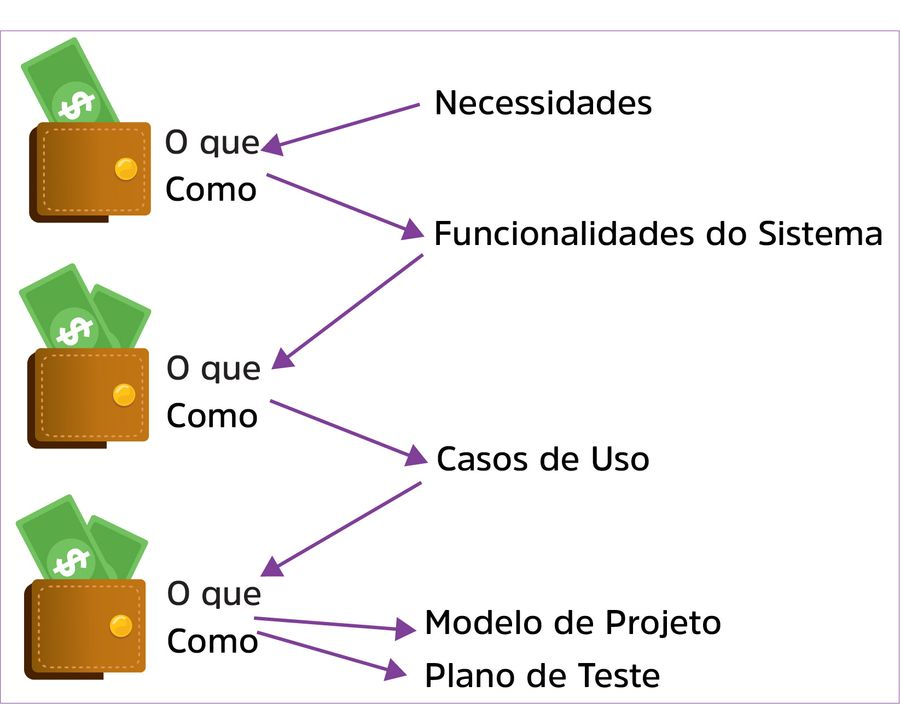

Requisitos de um sistema são descrições do que o software deve fazer, os serviços que devem ser fornecidos por esse sistema e as suas restrições operacionais. Os requisitos descrevem o que o software deve fazer e o que não deve fazer sem dizer como fazer (SOMMERVILLE, 2011).

define-se requisitos de software como:
1. Uma condição ou uma capacidade de que o usuário necessita para solucionar um problema ou alcançar um objetivo;
2. Uma condição ou uma capacidade que deve ser alcançada ou possuída por um sistema ou componente do sistema, para satisfazer um contrato, um padrão, uma especificação ou outros documentos impostos formalmente;
3. Uma representação documentada de uma condição ou capacidade (_on-line_).

Os requisitos de software existem em diversos níveis:
	

Os ==requisitos funcionais== estão relacionados às funções de negócios do dia a dia que os usuários executam no sistema, como, por exemplo, o usuário deve ser capaz de pesquisar em todo o conjunto inicial de um banco de dados.

Requisitos funcionais podem ser descritos por meio de diagramas de casos de uso e de especificação de casos de uso, mas também podem ser descritos na forma declarativa.
Exemplos:
- cadastrar clientes;
- fazer análise de crédito;
- fazer uma transação com banco de dados;
- cadastrar um registro de atendimento;
- imprimir relatório etc.

