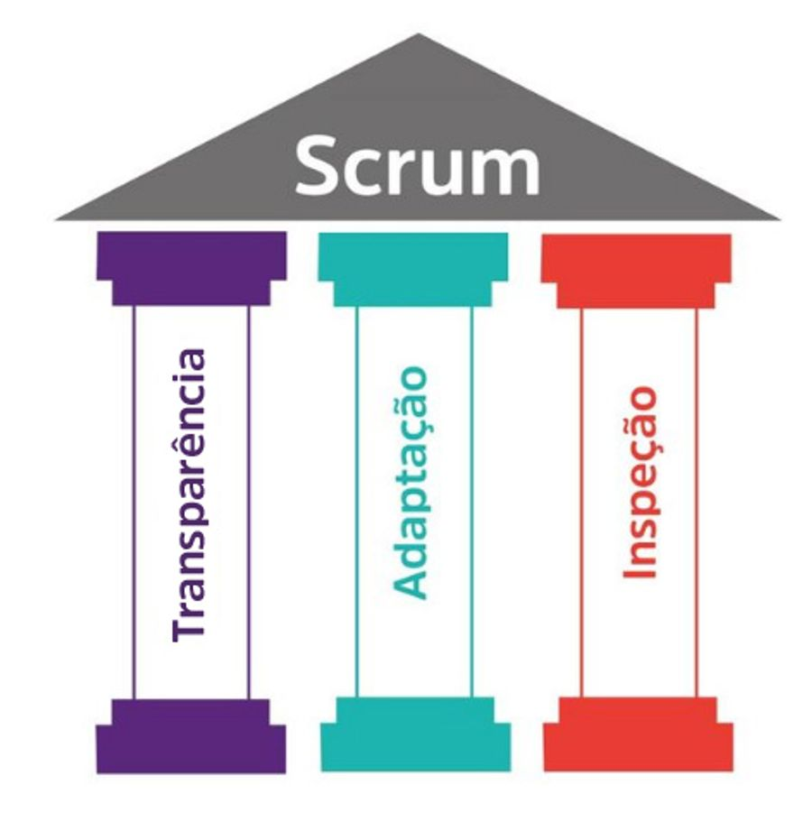

Scrum é o nome de uma das jogadas do Rugby, tendo como principal característica a formação vista ao lado. Disputa-se a reposição de bola e é necessária a participação de todos os jogadores do time atuando em conjunto no mesmo objetivo, sendo que se um deles falhar, todos falham. Este trabalho em equipe é bem caracterizado no _framework_ do Scrum, por isso o seu nome.

O Scrum, processo definido por Schwaber e Sutherland (2001), foi criado para o gerenciamento do desenvolvimento de software em ambientes cujos requisitos são voláteis. É uma abordagem empírica baseada na flexibilidade, adaptabilidade e produtividade.

Scrum é fundamentado nas teorias empíricas de controle de processo, ou empirismo. O empirismo afirma que o conhecimento vem da experiência e de tomada de decisões baseadas no que é conhecido. O Scrum emprega uma abordagem iterativa e incremental para aperfeiçoar a previsibilidade e o controle de riscos.

Três pilares apoiam a implementação de controle de processo empírico:

## Transparência:
Todos os interessados do time devem utilizar as mesmas ferramentas para garantir uma comunicação fluida, e também devem discutir todas as etapas sem esconder nenhuma, tudo deve ser feito em conjunto e a definição de algo "Pronto" deve ser a mesma para quem trabalha e recebe esse trabalho

## Inspeção:
Os membros envolvidos devem com certa frequência, inspecionar os artefatos, o progresso com a intenção de detectar a direção em que o projeto está caminhando e detectar possíveis variações. Essa inspeção não deve atrapalhar a execução do projeto e é melhor executada quando feita por uma equipe especializada em verificar.

## Adaptação:
Se um inspetor determina que um ou mais aspectos de um processo desviou para fora dos limites aceitáveis, e que o produto resultado será́ inaceitável, o processo ou o material sendo produzido deve ser ajustado. O ajuste deve ser realizado o mais breve possível para minimizar mais desvios.

O Scrum prescreve quatro Eventos formais, contidos dentro dos limites da Sprint, para inspeção e adaptação:
- reunião de planejamento da Sprint;
- reunião diária;
- reunião de revisão da Sprint;
- retrospectiva da Sprint.