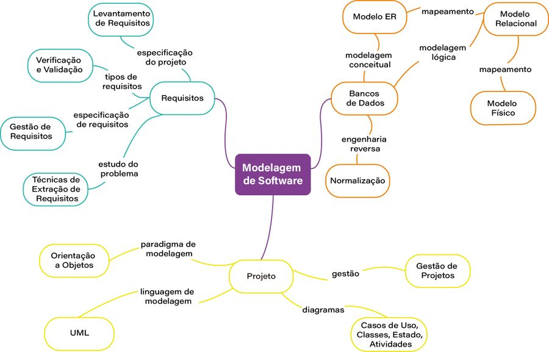

levantamento e a identificação das necessidades e características que o software deve apresentar. Essas definições são chamadas de ==requisitos==.

descrições textuais e representações gráficas são empregadas para a realização da análise do sistema. Nesta fase, os requisitos são trabalhados de acordo com uma visão do mundo real.

projetar o software é o momento em que descrevemos e desenhamos como o software vai funcionar em uma determinada estrutura computacional

UML (_Unified Modeling Language_) visa a uma melhor estruturação do software, bem como uma padronização do processo de modelagem

